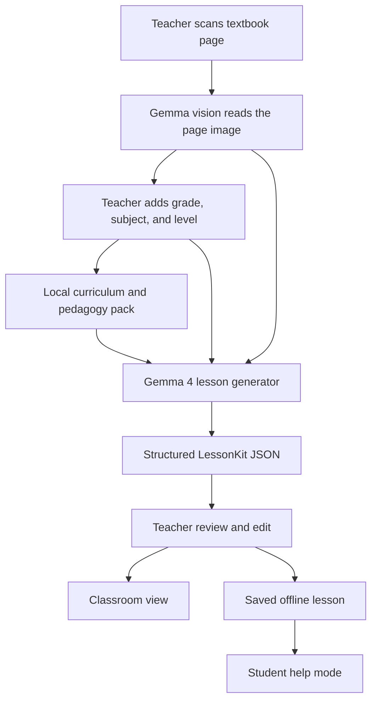

# Technical Architecture

## Recommended Architecture

Use a mobile-first app with local inference where possible, plus a local desktop fallback for reliability during demo.

### Layer 1: App UI

Recommended:

- Flutter for Android-first mobile app

Why:

- Fast to build.
- Good camera support.
- Good offline storage.
- Can demo on phone, emulator, or desktop.
- Aligns with on-device story.

Screens:

- Home
- Scan Textbook
- Lesson Kit
- Student Help
- Saved Lessons
- Settings / Model Mode

### Layer 2: Local AI Runtime

Preferred target:

- Gemma 4 E2B or E4B local model for mobile.

Possible runtime options:

- LiteRT for Google AI Edge prize.
- Cactus for local-first mobile/wearable model routing prize.
- Ollama for local laptop fallback and reliable public demo.

Practical plan:

1. Build the product flow independent of runtime.
2. Implement a `ModelGateway` interface.
3. Support multiple backends:
   - `LocalGemmaMobileBackend`
   - `OllamaBackend`
   - `MockBackend` for UI development only
4. Use the real Gemma backend for final demo.

### Layer 3: Orchestration

The app should not ask Gemma for free-form prose only. It should request structured JSON.

Core schema:

```json
{
  "lesson_title": "Water Cycle",
  "grade": "Class 5",
  "subject": "Science",
  "language": "English",
  "learning_objectives": [],
  "simple_explanation": "",
  "blackboard_notes": [],
  "local_example": "",
  "oral_quiz": [],
  "group_activity": "",
  "homework": [],
  "glossary": [],
  "easy_version": "",
  "advanced_version": "",
  "safety_notes": [],
  "confidence": 0.0
}
```

Use function-style actions:

- `extract_textbook_concepts`
- `generate_lesson_kit`
- `adapt_to_classroom_style`
- `make_quiz`
- `make_easy_explanation`
- `create_homework`
- `save_lesson`

### Layer 4: Retrieval Pack

Local curriculum pack:

- Grade-wise subject outlines
- Sample textbook concepts
- Pedagogy templates
- Practical examples
- Key-terms glossary
- Safety/quality rules

The pack should be stored locally so the app can ground outputs without internet.

### Layer 5: Storage

Local database:

- SQLite or Hive

Data:

- Saved lessons
- Teacher settings
- Recent scans
- Model mode
- Output preference
- Evaluation samples

### Layer 6: Optional Sync

Only after MVP:

- Sync saved lessons.
- Download new curriculum packs.
- Upload anonymous evaluation feedback.

The core demo should still work offline.

## Architecture Diagram



## Public Demo Strategy

Judges need a live demo. A pure mobile APK is acceptable if packaged well, but a web demo is easier to access.

Recommended:

- Main demo: mobile app screen recording and APK.
- Public live demo: web version or hosted Flutter web app with sample pages and a Gemma/Ollama backend if feasible.
- Repo includes instructions for local Gemma/Ollama run.

## Technical Proof Points

The writeup should prove:

- Gemma 4 handles image/text input.
- Structured generation is real.
- Offline/local path exists.
- Plain-English adaptation is more than summarization.
- Fine-tuning or RAG improves output quality.
- The app is functional, not a static mock.
